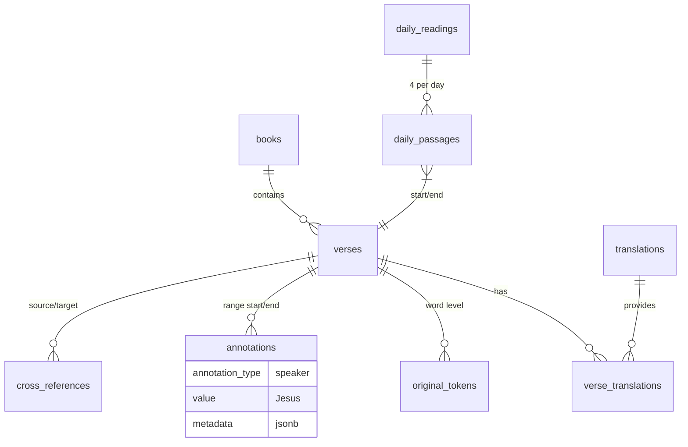

# 365DBR Relational Database Schema (Initial Design)

**Status**: Initial design for DB design phase kickoff (2026-07-01). Documentation-first (Document > Research > Re-document). Based on fresh analysis of production data.

**Core References** (re-read at start of any work):
- `docs/INDEX.md` (Database Strategy section and Current Phase)
- `docs/Project Blueprint_ Scriptural Intelligence (SI).md` (Tiers, "Deep Thought")
- `docs/365DBR/Data-Sources.md` (PRODUCTION DATA ONLY: https://mt-sin.ai/365DBR/data/ MMDD/)
- `docs/365DBR_AGENTS.md`
- `docs/Past-Agents-Knowledge-Organization.md` (data validation patterns)
- This file + Migration-Plan.md

**Non-Negotiable Principles** (from role + Blueprint):
- The 66 books of Scripture (Hebrew/Greek originals read literally and contextually) are Tier 1 absolute truth. Schema and data must faithfully represent literary structure, context, and text without distortion, anachronism, or overlay.
- Chapters and verses are **later man-made additions** (and vary by translation/edition). The design must support them for alignment/human reference **but not be limited by them**. Native support for arbitrary ranges, literary units, speaker/audience/timing/subject/genre/theme/cross-ref/semantic metadata.
- Strict data integrity: fail fast on corruption/mismatch. Use production data exclusively for population.
- Align with S.I. tiers: Bible primary; enable queries that can be validated first against the text itself.
- Multiple access paths: BCV reference, strongs/morph, speaker, chronology, theme, semantic, full-text, word-level, range, daily-plan, etc. For "Deep Thought" power.
- Original languages + linguistic annotations (Strong's primary now; morphology/lemma/parsing future).
- Multiple translations with robust, verifiable cross-mapping/alignment (verse-level initial; word-level where data supports).
- Support immediate 365DBR daily reading (4 sections/day: OT seq, NT, PSA, PRO) + long-term S.I.

## Current Data Model Analysis (from Production)

**Source**: Real data at https://mt-sin.ai/365DBR/data/ (e.g., 0701/, 0630/). **Never use repo `apps/365DBR/data/` for authoritative content.**

Fetched and analyzed (manifest + full passages):
- `manifest.json`: `{ "label": "...", "files": ["2KI.15.1-2KI.16.20.json", ...] }` (4 files/day).
- Passage JSON (api.bible shape):
  ```json
  {
    "data": {
      "id": "PRO.16.16-PRO.16.17",
      "bibleId": "0b262f1ed7f084a6-01",  // OT Hebrew source (or NT Greek)
      "bookId": "PRO",
      "chapterIds": ["PRO.16"],
      "reference": "...",
      "content": [ /* nested: para > char (style:"w", strong:"H7069") > text (verseId, verseOrgIds) + plain text nodes */ ],
      "parallels": [
        { "bibleId": "de4e12af7f28f599-01", "content": [ /* KJV English */ ] },
        { "bibleId": "01b29f4b342acc35-01", "content": [ /* LSV English */ ] }
      ],
      ...
    },
    "meta": {...}
  }
  ```
- **Key observations**:
  - Main `content`: original language — **Hebrew** (OT/PSA/PRO source bibleId `0b262f1ed7f084a6-01`) vs **Greek** (NT source bibleId `7644de2e4c5188e5-01`). 
    - Hebrew passages: word-level tagging (`char` style="w" with `strong:"Hxxxx"`) + surface text. Strong's reliably present.
    - Greek passages (confirmed on ACT.7 etc. from prod 0701): primarily running prose text nodes with accented Greek characters directly under paras. **No strong attrs or Gxxxx in current data for the Greek source**. (Client still captures full Greek surface as "original".)
  - Parallels: English translations (primary LSV `01b29f4b...`; KJV). Text collected per verseId using verseOrgIds for alignment.
  - Client processing (index.html `walkItems` / `processResults` / `buildFinalData` + bible.html): produces `verseMap` keyed by BCV verseId with `{ original: {text: joined ('' sep for Hebrew/Greek)}, lsv: {...}, kjv: {...} }`. `isHebrew = !NT_BOOKS.has(book)` drives labeling ("ORIGINAL HEBREW" vs "GREEK"), CSS direction (rtl for Heb), and styling. Arrays flattened (see 365DBR_AGENTS.md constraint).
  - Readings plan (`data/readings.json`): exactly 365 entries. Each: `{"day": "MMDD", "api_format": "...OT,NT,PSA,PRO...", "ot/nt/ps/pr_verse_count": N}`. Progressive coverage.
  - Known issues handled in pipeline: cross-book splits, omissions injection (**NT-specific**, KNOWN_OMISSIONS mostly Greek critical text), strict count validation using `BIBLE_DATA`.
  - Current: LSV primary. LSB pending. Future translations require new parallel fetches + alignment validation.
  - No rich contextual metadata yet. Strong's currently Hebrew-primary in ingested data.
  - **Greek vs Hebrew difference impact**: Tokenization, strongs availability, text direction, and future morph/lemma sources will differ. Schema must (and does) accommodate via `language` + nullable `strong_number`. See NT/Greek section below.

**Limitations of current (to overcome)**: Locked to BCV keys (man-made), flat per-day JSON files, no native range queries across arbitrary literary/thematic units, no built-in multi-translation consistency beyond verse, limited linguistic beyond Strong's (Hebrew-only in current sources), no provenance for metadata.

## OT vs NT / Hebrew vs Greek Specifics

The original language data **differs structurally** between testaments (confirmed via production data fetches on 0701 Hebrew vs Greek passages):

- **Hebrew (OT, PSA, PRO)**: Main content uses per-word `char` tags (`style: "w"`, `strong: "Hxxxx"`). Rich for linguistic queries today. Text is often unpointed or minimally pointed; right-to-left.
- **Greek (NT)**: Main content is running text (accented Greek in `text` nodes). No `strong` attributes or Gxxxx in the SBLGNT-based source used for current 365DBR data. Greek strongs/morph will require future enhanced sources (different api.bible resources, or external lexicons aligned to SBLGNT/NA28). Left-to-right.

**Schema accommodations (no breaking changes)**:
- `original_tokens.language`: 'hebrew' | 'greek' (enforced or documented).
- `original_tokens.strong_number`: populated for Hebrew words from current data; frequently NULL for Greek tokens until better sources. Still store surface_text + word_order per verse for both.
- `books.testament` + client-side `NT_BOOKS` / `isHebrew` logic already distinguish.
- Full-text: `text_tsv` on English; consider language-specific configs or separate original_tsv columns later for Greek search.
- Omissions / validation: Primarily affect NT (KNOWN_OMISSIONS in bible_common.py).
- Client rendering: direction + class already handled (`hebrew` vs `greek`).

**ETL / future notes**: Parsing branch required (word-tagged walk for Hebrew; sentence/word-split for Greek surface). Strongs search examples will initially return mostly Hebrew results. For S.I. "Deep Thought" on Greek, plan augmentation step (post v1).

This was the explicit review requested; design remains sound and handles both faithfully.

## Technology Recommendation

**Primary: PostgreSQL** (recommended; aligns with Blueprint example).

**Rationale**:
- Full ACID + strict relational integrity (critical for "fail fast on corruption").
- Excellent native support for text (TSVECTOR full-text search), JSONB (flexible annotations without sacrificing structure), arrays, ranges.
- Advanced indexing (GIN, GiST, trigram for fuzzy/strongs search).
- Mature ecosystem for Bible-scale data (millions of tokens ok).
- Extensions: `pg_trgm`, `fuzzystrmatch`, future `pgvector` or similar for semantic embeddings in S.I. layer.
- Hosting: **local Docker Postgres (workshop today)**. Production 365DBR is GoDaddy **shared hosting**, which **cannot** run PostgreSQL or this schema. Do not treat shared hosting as “compatible” with a live Bible DB. Do not port to cPanel MySQL. Future public runtime: a cheap VPS or managed Postgres (Neon, Supabase, AWS RDS, Render) **when the owner can afford it**. Canonical: `docs/365DBR/Hosting-and-Runtime.md`.
- Tooling: Python (psycopg / SQLAlchemy / Alembic for migrations), easy ETL from existing JSON pipeline.
- Proven for linguistic/scripture data (many open projects use PG or similar).

**Trade-offs**:
- Vs SQLite: PG requires server (or libpq); SQLite simpler for pure client/embedded but weaker on concurrent writes, fulltext, JSON power, and future S.I. scale. Use SQLite only for throwaway prototypes.
- Vs Mongo/JSON-only: Loses relational power for joins (e.g., "all Jesus words + their strongs + cross-refs"). We need **highly relational** per requirements.
- Vs MySQL/Maria: PG superior text/JSON/indexing and standards compliance for this workload.
- Cost/ops: Local Postgres + Docker is the **only** current DB. Matching 365DBR’s current host (GoDaddy shared) is **not possible** for this workload. Paid Postgres-capable hosting is a future budget item, not a now-task.
- Future: Can add read replicas, partitioning by book/testament, materialized views for daily readings.

**Other choices documented**:
- ORM/Migrations: SQLAlchemy + Alembic (or raw SQL + versioned scripts for simplicity/auditability).
- ETL: Extend existing Python (new `etl/` or integrate with `fetch_readings.py` / new `populate_db.py`). Use production endpoints or mirrored data/ snapshots.
- Access layer (for apps/S.I.): Local queries + `serve_query_api.py` on localhost. Public site uses **pre-generated static JSON** (`data/` + `ws/`). A public API is frozen until hosting can run Postgres + HTTPS + CSP allowlist.
- Validation: Reuse/enhance `bible_common.py` logic + DB constraints/triggers.

**Alternatives considered (and why deprioritized for v1)**: Pure JSONB document store (insufficient relations), graph DB (overkill initially; can layer later for themes), custom in-memory (no durability/integrity).

## Proposed Initial Schema (v0.1 – Highly Relational, Extensible)

Focus: Ingest current data faithfully first (text + strongs + translations + plan), then layer rich metadata. Support BCV for compatibility + independent literary/context paths.

Use surrogate + natural keys. Verse IDs as stable strings ('BOOK.CC.V') for human/debug + joins.

```sql
-- Core reference
CREATE TABLE books (
    code            TEXT PRIMARY KEY,           -- 'GEN', 'PSA', 'MAT'
    name            TEXT NOT NULL,              -- 'Genesis'
    testament       TEXT NOT NULL CHECK (testament IN ('OT','NT')),
    order_canonical INT NOT NULL UNIQUE,
    num_chapters    INT NOT NULL,
    is_poetic       BOOLEAN DEFAULT FALSE,      -- e.g. PSA, PRO, JOB for special handling
    metadata        JSONB DEFAULT '{}'          -- future: genre, traditional author, etc.
);

CREATE TABLE verses (
    id              TEXT PRIMARY KEY,           -- 'GEN.1.1' (stable human + join key)
    book_code       TEXT NOT NULL REFERENCES books(code),
    chapter         INT NOT NULL,
    verse           INT NOT NULL,
    verse_order     INT NOT NULL,               -- global sequential order (enables "next/prev" beyond ch)
    UNIQUE (book_code, chapter, verse)
);

-- Translations (LSV primary; add KJV, future LSB/WEB/etc)
CREATE TABLE translations (
    id              SERIAL PRIMARY KEY,
    code            TEXT UNIQUE NOT NULL,       -- 'LSV', 'KJV'
    name            TEXT NOT NULL,              -- 'Literal Standard Version'
    language        TEXT NOT NULL DEFAULT 'en',
    source_bible_id TEXT,                       -- api.bible id for provenance
    is_primary      BOOLEAN DEFAULT FALSE,
    license         TEXT,
    added_date      DATE DEFAULT CURRENT_DATE
);

-- Per-verse text (fast path for display + search). 1 row per (verse, translation)
CREATE TABLE verse_translations (
    verse_id        TEXT NOT NULL REFERENCES verses(id),
    translation_id  INT NOT NULL REFERENCES translations(id),
    text            TEXT NOT NULL,
    text_tsv        tsvector GENERATED ALWAYS AS (to_tsvector('english', text)) STORED,
    source_note     TEXT,                       -- e.g. 'api.bible 0701 snapshot'
    PRIMARY KEY (verse_id, translation_id)
);

-- Original language tokens (word-level; enables Strong's, morphology queries, alignment)
-- NOTE on Greek vs Hebrew (see OT/NT section): current prod data provides strongs reliably only for Hebrew.
-- Greek tokens will use surface_text primarily (strong_number often NULL until enhanced Greek sources added).
CREATE TABLE original_tokens (
    id              BIGSERIAL PRIMARY KEY,
    verse_id        TEXT NOT NULL REFERENCES verses(id),
    word_order      INT NOT NULL,               -- within verse (or global pos later)
    language        TEXT NOT NULL,              -- 'hebrew' | 'greek' (distinguishes tokenization + direction)
    surface_text    TEXT,
    strong_number   TEXT,                       -- 'H7069' (Hebrew, current data); 'Gxxxx' rare/absent today for Greek
    lemma           TEXT,
    morph           TEXT,                       -- future: from enhanced api or other source
    extra           JSONB DEFAULT '{}',
    UNIQUE (verse_id, word_order)
);

-- Rich contextual / literary / S.I. metadata (the "FAR BEYOND" part)
-- Linked to verse *ranges* (not just single BCV) to respect literary structure.
CREATE TABLE annotations (
    id                  BIGSERIAL PRIMARY KEY,
    annotation_type     TEXT NOT NULL,          -- 'speaker', 'audience', 'chronology', 'setting',
                                                -- 'genre', 'literary_unit', 'theme', 'cross_reference',
                                                -- 'theological_link', 'semantic_tag'
    start_verse_id      TEXT NOT NULL REFERENCES verses(id),
    end_verse_id        TEXT NOT NULL REFERENCES verses(id),
    value               TEXT NOT NULL,          -- e.g. 'Jesus', 'Creation Week', 'Covenant', 'David'
    metadata            JSONB DEFAULT '{}',     -- e.g. {"quote_type": "direct", "certainty": 0.95, "refs": [...] }
    source              TEXT,                   -- 'curated-manual', 'public-domain', 'inferred-from-text'
    created_at          TIMESTAMPTZ DEFAULT now(),
    CHECK (start_verse_id <= end_verse_id)      -- simple range (lex compare works for 'GEN.1.1' style)
);

-- Cross-references (thematic + explicit)
CREATE TABLE cross_references (
    id              BIGSERIAL PRIMARY KEY,
    source_start    TEXT REFERENCES verses(id),
    source_end      TEXT REFERENCES verses(id),
    target_start    TEXT REFERENCES verses(id),
    target_end      TEXT REFERENCES verses(id),
    ref_type        TEXT,                       -- 'quote', 'allusion', 'parallel', 'fulfillment'
    note            TEXT,
    source          TEXT
);

-- Daily reading plan (powers 365DBR experience directly from DB)
CREATE TABLE daily_readings (
    day             TEXT PRIMARY KEY,           -- '0101'
    label           TEXT NOT NULL,
    reading_time_min INT,                       -- computed or stored
    total_verses    INT
);

CREATE TABLE daily_passages (
    id              SERIAL PRIMARY KEY,
    day             TEXT NOT NULL REFERENCES daily_readings(day),
    section         TEXT NOT NULL,              -- 'OT', 'NT', 'PSA', 'PRO'
    start_verse_id  TEXT NOT NULL REFERENCES verses(id),
    end_verse_id    TEXT NOT NULL REFERENCES verses(id),
    file_ref        TEXT,                       -- original filename for provenance
    verse_count     INT,
    UNIQUE (day, section)
);

-- Provenance / migration audit
CREATE TABLE data_sources (
    id              SERIAL PRIMARY KEY,
    source_url      TEXT,                       -- https://mt-sin.ai/365DBR/data/0701/...
    fetch_date      DATE,
    bible_id_used   TEXT,
    notes           TEXT
);
```

**Indexes (critical for S.I. queries)**:
- On verses: (book_code, chapter, verse), verse_order.
- GIN on verse_translations.text_tsv (full text "wisdom gold").
- On original_tokens: (strong_number), (verse_id, word_order).
- On annotations: (annotation_type, value), (start_verse_id, end_verse_id), GIN(metadata).
- trigram indexes for fuzzy speaker/theme search.

**Views / Helper Functions** (examples for access paths):
- `vw_daily_full_text(day)` : joins daily + verse_translations (LSV).
- `find_by_strong(strong)` : tokens + verse + LSV text.
- `passages_by_speaker(speaker, start_day?, end_day?)`.
- Range expansion functions that return all verses in literary annotation.

**Mermaid ERD (simplified)**:


**Extensibility notes**:
- Add `morphology_sources` table or columns when enhanced data available.
- `literary_units` as first-class (separate from generic annotations) for structure (chiasm, stanza, pericope).
- Chronology: `timeline_events` or annotation_type + metadata for "year from creation", "ministry phase".
- Full Bible population: verses table will hold all; daily is a view/subset + curated plan.
- Multi-translation alignment: verse_translations + future token_alignment table if word-for-word needed beyond verse.
- S.I. "Deep Thought": this schema + strict Tier 1 checks in query layer (never override text with man's consensus).

**v0.1 Scope (initial)**: books + verses + translations + verse_translations + original_tokens + daily_* + basic annotations skeleton. Rich curation in parallel workstream.

## Decisions & Trade-offs Documented

- **BCV as core key but not sole path**: Practical (current data + all translations + human refs use it). But design prioritizes ranges + tokens + annotations to "go FAR BEYOND".
- **Word-level tokens over verse-only text**: Required for linguistic (Strong's search, morphology future) and precise attribution. Still link to verse for compatibility.
- **JSONB for metadata**: Flexible for evolving annotations (speaker details, thematic links) without constant schema churn. Queryable.
- **Separate daily tables**: Direct support for 365DBR without polluting verses. Easy to evolve plan.
- **No premature full-text embeddings**: Relational first; vector later for semantic (S.I. phase).
- **Fail-fast integrity**: Replicate pipeline validations (counts, book membership, range containment) as DB constraints + ETL checks. Add provenance.
- **Start narrow, grow**: Ingest LSV + current parallels + strongs from existing prod JSONs. LSB etc. added when data access confirmed (new parallel fetches + alignment audit).
- **Document > Research > Re-document**: This is v0.1. Will iterate after DEV feedback, sample population, and S.I. query prototyping.

**Open questions (to resolve next)**:
- Exact morphology availability from api.bible or alternate sources for Hebrew/Greek.
- How to seed initial rich annotations (e.g. public domain "red letter" + manual review for speaker/setting; cross-ref sources like Treasury of Scripture Knowledge).
- Storage for full historical snapshots vs live.
- Handling of variant versification (future translations).

See Migration-Plan.md for how to realize this schema.

**Last updated**: 2026-08-26 (hosting freeze: this schema is local-workshop + future paid host; not GoDaddy shared). Reference in INDEX.md.
